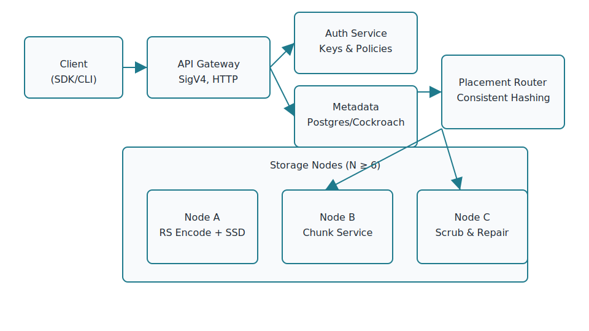

# TitanS3

TitanS3 is a production-grade, S3-compatible object storage platform designed for horizontal scale, strong durability, and a clean Go implementation. This repository collects the architecture brief, visual aids, and implementation guidelines for building the system described in the TitanS3 build spec.

## Highlights

- **Feature set:** Buckets, object CRUD, multipart uploads, versioning, bucket policies/ACLs, lifecycle management, server-side encryption (SSE-S3, SSE-C), presigned URLs, and observability hooks.
- **Scale and durability:** Shared-nothing nodes, Reed-Solomon erasure coding (e.g., RS(8+4)), consistent hashing placement, quorum reads/writes, background scrubbing, and hinted handoff.
- **Security posture:** SigV4 authentication, TLS everywhere, Argon2id credential storage, per-object data keys with pluggable KMS, immutable audit logging, and policy-based authorization.
- **Operational focus:** Metrics, tracing, structured logging, admin APIs, lifecycle tasks, repair tooling, and deployment recipes for Docker Compose and Kubernetes.

## Architecture Overview

The architecture couples a stateless API gateway with a metadata service backed by Postgres/Cockroach, a placement/router component that calculates erasure-coded shard layouts, and a fleet of storage nodes that hold the encoded chunks. Each node operates on local disks, participates in repair/scrub routines, and exposes gRPC interfaces for data flow.

## Write Path Snapshot

A typical PUT request flows through the gateway, which validates SigV4 signatures, streams data into the ingest pipeline, erasure-encodes parts, and consults the placement router for shard destinations. Metadata transactions finalize in the database before the client receives an acknowledgment with the object ETag.

## Build Plan Reference

The Go codebase is organized around dedicated services (`/cmd/gw`, `/cmd/meta`, `/cmd/node`) and supporting packages (`/pkg/api/s3`, `/pkg/meta`, `/pkg/placement`, `/pkg/ec`, `/pkg/kms`, `/pkg/observe`, etc.). Milestones progress from single-node functionality to multi-node EC replication, encryption, lifecycle automation, and policy enforcement.

For the full design specification—including data models, API coverage, security measures, deployment templates, and roadmap—consult the TitanS3 build spec in the project root or the accompanying documentation bundle.
